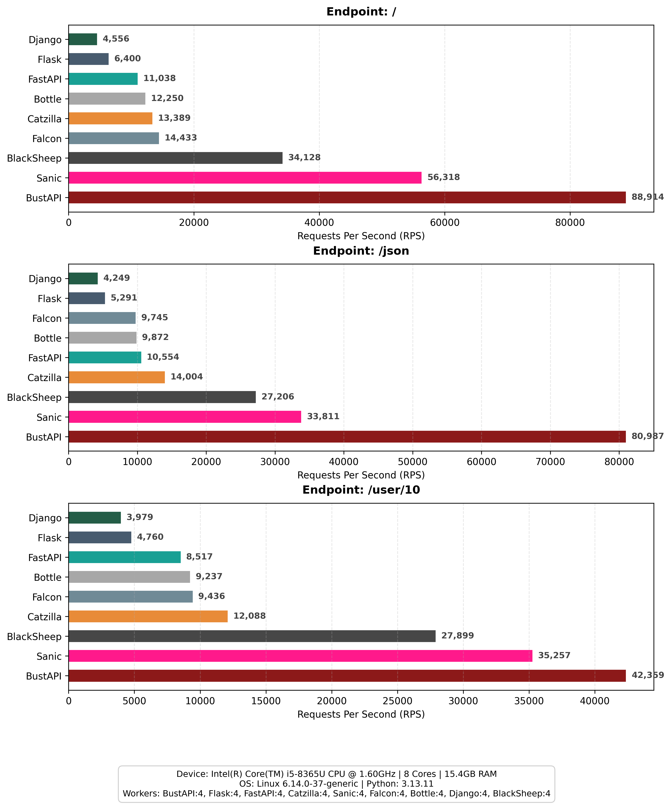

# ⚡ Ultimate Web Framework Benchmark

> **Date:** 2026-02-10 | **Tool:** `wrk`

## 🖥️ System Spec
- **OS:** `Linux 6.17.0-14-generic`
- **CPU:** `Intel(R) Core(TM) i5-8365U CPU @ 1.60GHz` (8 Cores)
- **RAM:** `15.4 GB`
- **Python:** `3.13.11`

## 🏆 Throughput (Requests/sec)

| Endpoint | Metrics | BustAPI (4w) | Flask (4w) | FastAPI (4w) | Sanic (4w) | Falcon (4w) | Bottle (4w) | Django (4w) | BlackSheep (4w) |
| :--- | :--- | :---: | :---: | :---: | :---: | :---: | :---: | :---: | :---: |
| **`/`** | 🚀 RPS | 🥇 **86,033** | **6,779** | **12,676** | **78,300** | **19,153** | **14,494** | **4,253** | **32,319** |
|  | ⏱️ Avg Latency | 1.20ms | 14.57ms | 8.03ms | 1.32ms | 5.04ms | 6.61ms | 23.17ms | 3.20ms |
|  | 📉 Max Latency | 21.63ms | 40.73ms | 44.62ms | 16.64ms | 24.90ms | 29.35ms | 44.76ms | 32.85ms |
|  | 📦 Transfer | 10.58 MB/s | 1.07 MB/s | 1.78 MB/s | 8.74 MB/s | 2.89 MB/s | 2.29 MB/s | 0.75 MB/s | 4.53 MB/s |
|  | 🔥 CPU Usage | 672% | 381% | 377% | 377% | 379% | 363% | 365% | 344% |
|  | 🧠 RAM Usage | 166.1 MB | 159.0 MB | 251.3 MB | 240.7 MB | 147.8 MB | 125.8 MB | 189.1 MB | 217.0 MB |
| | | --- | --- | --- | --- | --- | --- | --- | --- |
| **`/json`** | 🚀 RPS | 🥇 **76,855** | **6,350** | **10,986** | **57,900** | **13,453** | **12,238** | **3,926** | **31,152** |
|  | ⏱️ Avg Latency | 1.34ms | 15.54ms | 9.13ms | 1.71ms | 7.20ms | 7.79ms | 25.13ms | 3.28ms |
|  | 📉 Max Latency | 14.46ms | 51.84ms | 33.16ms | 29.91ms | 39.38ms | 20.39ms | 40.47ms | 24.69ms |
|  | 📦 Transfer | 9.16 MB/s | 0.99 MB/s | 1.49 MB/s | 6.18 MB/s | 2.09 MB/s | 1.90 MB/s | 0.68 MB/s | 4.22 MB/s |
|  | 🔥 CPU Usage | 368% | 375% | 375% | 766% | 380% | 366% | 365% | 369% |
|  | 🧠 RAM Usage | 164.1 MB | 159.1 MB | 252.7 MB | 240.8 MB | 148.0 MB | 126.1 MB | 189.3 MB | 217.6 MB |
| | | --- | --- | --- | --- | --- | --- | --- | --- |
| **`/user/10`** | 🚀 RPS | 🥇 **50,117** | **6,581** | **8,968** | **48,019** | **13,465** | **10,405** | **3,982** | **41,885** |
|  | ⏱️ Avg Latency | 2.01ms | 15.00ms | 11.18ms | 2.12ms | 7.04ms | 9.19ms | 24.71ms | 2.45ms |
|  | 📉 Max Latency | 12.68ms | 40.60ms | 40.73ms | 41.18ms | 13.81ms | 22.39ms | 45.71ms | 25.22ms |
|  | 📦 Transfer | 5.83 MB/s | 1.00 MB/s | 1.19 MB/s | 4.99 MB/s | 2.05 MB/s | 1.59 MB/s | 0.68 MB/s | 5.55 MB/s |
|  | 🔥 CPU Usage | 364% | 383% | 364% | 382% | 383% | 365% | 394% | 382% |
|  | 🧠 RAM Usage | 163.2 MB | 159.1 MB | 253.1 MB | 240.9 MB | 148.1 MB | 126.4 MB | 189.3 MB | 218.1 MB |
| | | --- | --- | --- | --- | --- | --- | --- | --- |

## 📊 Performance Comparison


## ⚙️ How to Reproduce
```bash
uv run --extra benchmarks benchmarks/run_comparison_auto.py
```